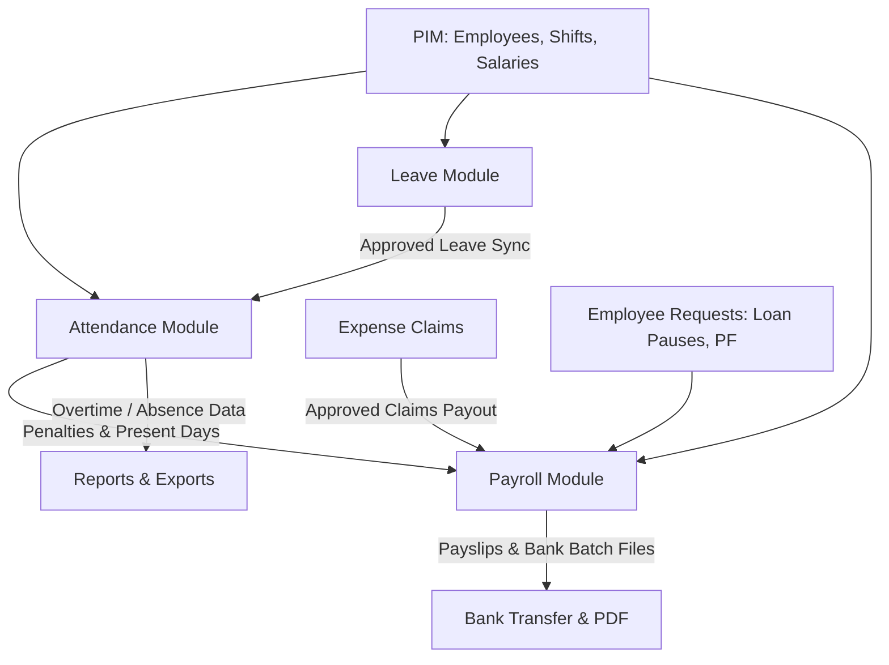

# HRM System - Module Explanations & Business Logic

A comprehensive technical and functional reference for all core modules, domain models, algorithms, and cross-module integrations in the HRM system.

---

## 1. LEAVE MODULE - Complete Working & Logic

### Overview
The Leave Module manages employee leave requests, atomic balance tracking across calendar years, approval workflows, configurable sandwich rules, and automatic synchronization with attendance records.

### Dynamic Leave Types
Leave categories are stored in the database (`LeaveType` model) and configurable by administrators:
* **Annual Leave**: Default 20 days/year (Paid)
* **Casual Leave**: Default 10 days/year (Paid)
* **Sick Leave**: Default 8–10 days/year (Paid)
* **Unpaid Leave**: Uncapped days (Unpaid)
* **Maternity / Paternity / Special**: Custom-configurable with sandwich rule toggles

Each leave type specifies:
* `name`: Display name (e.g., "Casual Leave")
* `code`: Unique identifier (e.g., "casual", "annual", "sick")
* `defaultDays`: Standard annual allocation
* `isPaid`: Boolean flag (paid vs. unpaid)
* `isActive`: Active/disabled status
* `sandwichRuleEnabled`: Whether weekend sandwiching applies

### Leave Request Statuses
1. **Pending** → Submitted by employee or manager, awaiting approval (days reserved as `pending`)
2. **Approved** → Approved by authorized manager/admin (moved `pending` ➔ `used`)
3. **Rejected** → Declined by manager/admin (`pending` days released back to `available`)
4. **Cancelled** → Cancelled by employee or admin before or after action

---

### Conditions & Logic

#### 1. **Leave Days Calculation & Sandwich Rule**
Leave days are calculated between `startDate` and `endDate`:
```
FOR EACH calendar day in range:
├─ IF day is Monday – Friday:
│  └─ Count as 1 leave day
│
└─ ELSE IF day is Saturday or Sunday:
   ├─ IF sandwichRuleEnabled == false:
   │  └─ Skip (Do NOT count weekend)
   │
   └─ ELSE (Sandwich rule is active):
      ├─ Check if preceded by a requested weekday in range AND
      │  followed by a requested weekday in range
      ├─ IF Yes → Weekend is "sandwiched" ➔ Count as leave day
      └─ IF No  → Skip weekend
```

*Half-day requests:* If duration is `First Half`, `Second Half`, or `Half Day`, the deduction is recorded as `0.5` days.

#### 2. **Multi-Year Support & Atomic Balance Reservations**
When a leave request spans across calendar year boundaries (e.g., Dec 28, 2025 to Jan 4, 2026):
```
1. Split requested dates by calendar year:
   ├─ 2025 days counted against 2025 LeaveBalance
   └─ 2026 days counted against 2026 LeaveBalance

2. ATOMIC TRANSACTION:
   ├─ For each year:
   │  ├─ Available = Total - (Used + Pending)
   │  ├─ Validate: Available >= Days Requested in that year
   │  └─ RESERVE: Pending += Days Requested
   ├─ Save LeaveRequest (Status: "Pending")
   └─ COMMIT TRANSACTION (Rollback on any insufficient balance)
```

#### 3. **Approval & Attendance Synchronization**
When a leave request is Approved (`PUT /api/leaves/:id/status`):
```
1. ATOMIC TRANSACTION:
   ├─ Leave.status = "Approved"
   ├─ For each year:
   │  └─ Balance: Pending -= Days, Used += Days
   └─ COMMIT

2. ATTENDANCE SYNCHRONIZATION:
   ├─ Loop through each date in the approved leave range
   └─ Execute processEmployeePunches(employeeId, dateStr, 'INTERNAL'):
      ├─ Attendance status updated to "On Leave" (or "Half-Day Leave" if 0.5)
      ├─ leaveType set to the approved leave category
      └─ Employee is protected from being marked Absent or incurring payroll cuts
```

#### 4. **API Endpoints**
| Endpoint | Method | Role | Action |
| :--- | :--- | :--- | :--- |
| `/api/leaves/mine` | GET | Employee | Personal leave history |
| `/api/leaves/balance` | GET | Employee/Admin | Personal or target leave balance |
| `/api/leaves/balances/all` | GET | Admin/HR | Org-wide leave balance ledger (supports `?year=` & `?month=`) |
| `/api/leaves` | POST | Employee/Manager | Submit new leave application |
| `/api/leaves/:id` | PUT | Employee/Manager | Edit pending leave request |
| `/api/leaves/:id/status` | PUT | Manager/Admin | Approve or reject leave request |
| `/api/leaves/:id/revert-status` | PUT | Admin/HR | Revert processed leave with balance re-adjustment |
| `/api/leaves/types` | GET/POST | Admin | View or create dynamic leave types |

---

## 2. EXPENSE CLAIM MODULE - Complete Working & Logic

### Overview
Multi-stage approval workflow for employee expense reimbursements with automated policy limits, receipt verification, and direct integration into payroll.

### Claim Categories & Policy Limits
* **Medical**: Annual policy limit (e.g. PKR 60,000/year); receipt strictly mandatory.
* **Training & Certification**: Requires comment (min 5 chars) or receipt.
* **Travel**: Routed to Line Manager; requires comment or receipt.
* **Sales / Customer Gifts**: Routed to Line Manager; requires comment or receipt.
* **Other**: General business expenses; routed to Line Manager.

### Multi-Stage Approval Chain by Category
```
MEDICAL:
  Employee ➔ HR Review ➔ Finance (Final) ➔ Approved

TRAINING & CERTIFICATION / TRAVEL / SALES / OTHER:
  Employee ➔ Line Manager ➔ HR Review ➔ Finance (Final) ➔ Approved
```

### Claim Statuses & State Machine
```
Draft ➔ Submitted ➔ Pending Line Manager ➔ Pending HR ➔ Pending Finance ➔ Approved
                                    └─────────────── Declined at any stage ───────────────┘
```
* **Admin Override**: Super-Admins and Admins can override any stage, auto-approve all remaining stages, and set the final approved amount directly.
* **Payroll Hand-Off**: Once a claim reaches `Approved` with payoutStatus `Unpaid`, it is automatically incorporated into the employee's next monthly payroll as non-taxable earnings and marked `Included in Payroll`.

---

## 3. ATTENDANCE MODULE (V2) - Complete Working & Logic

### Overview
Enterprise attendance system combining real-time hardware biometric machine ingestion (ZKTeco ADMS), shift rule engines, automated punch evaluation, and audit-logged manual adjustments.

### Attendance Statuses (11 Categories)
```
1. Present          → Met shift requirements, on time
2. Present (WFH)    → Approved Work From Home (excludes meal allowance in payroll)
3. Late             → Arrived after shift grace period (before 2:00 PM cutoff)
4. Half-Day         → Half-Day Absent: < 4 hours worked or early departure (0.5 salary cut penalty)
5. Half-Day Leave   → Approved 0.5-day leave (0.5 leave balance cut, full salary)
6. Early Leave      → Checked out > 10 minutes before scheduled shift end
7. On Leave         → Full day approved leave (synced from Leave Module)
8. Holiday          → Location or org-wide paid holiday
9. Weekend          → Saturday or Sunday non-working day
10. Absent          → No punches recorded, no approved leave, non-holiday
11. Incomplete      → Checked in but missing valid check-out punch
```

---

### Conditions & Logic

#### 1. **Shift Hierarchy & Resolution**
Shift configurations are evaluated in strict priority:
1. **Employee Custom Shift**: Explicitly assigned in `employee.jobInfo.shift`
2. **Device Location Configuration**: Configured on `DeviceLocation`
3. **System Defaults**: `09:00` start, `18:00` end, `30` min grace, `4` hr half-day threshold

#### 2. **Punch Validation & Calculations**
* **Valid Check-In**: First recorded punch of the day.
* **Valid Check-Out**: Last punch of the day occurring at least 60 minutes after check-in and after 1:00 PM.
* **Lunch Deduction**:
  ```
  IF (checkOut - checkIn) > 5 hours:
    └─ Deduct 60 minutes lunch
    └─ workDurationMinutes = (checkOut - checkIn) - 60
  ELSE:
    └─ workDurationMinutes = checkOut - checkIn
  ```
* **Late Minutes**:
  ```
  diffMins = checkIn - shiftStart
  IF diffMins > graceMinutes:
    └─ lateMinutes = diffMins - graceMinutes
  ELSE:
    └─ lateMinutes = 0
  ```
* **Overtime Minutes**:
  ```
  IF checkOut > shiftEnd:
    └─ overtimeMinutes = checkOut - shiftEnd
  ```

#### 3. **Policy Cutoffs & Status Determination**
```
IF punches == 0:
  ├─ Check Holiday  ➔ "Holiday"
  ├─ Check Leave    ➔ "On Leave" (or "Half-Day Leave")
  ├─ Check Weekend  ➔ "Weekend"
  └─ Otherwise      ➔ "Absent"

ELSE (has punches):
  ├─ IF checkIn >= 14:00 (2:00 PM):
  │  └─ Status = "Absent" (Full day salary cut per HR Policy)
  │
  ├─ ELSE IF checkIn > (shiftStart + graceMinutes):
  │  └─ Status = "Late" (Half day salary cut per HR Policy)
  │
  ├─ ELSE IF workDurationMinutes < (halfDayThresholdHours * 60) AND checkOut exists:
  │  └─ Status = "Half-Day"
  │
  ├─ ELSE IF checkOut < (shiftEnd - 10 mins):
  │  └─ Status = "Early Leave"
  │
  ├─ ELSE IF checkOut is missing:
  │  ├─ IF date < today ➔ Auto-close at shiftEnd ("Auto Clocked-Out")
  │  └─ IF date == today ➔ "Incomplete"
  │
  └─ ELSE:
     └─ Status = "Present"
```

#### 4. **Hardware ADMS Integration**
* ZKTeco devices push biometric punches directly to `/iclock/cdata` (rewritten internally to `/api/attendance/adms`).
* Unauthenticated hardware endpoint validates serial numbers (`deviceSN`), logs raw punches (`AttendancePunch`), and triggers asynchronous record processing.

#### 5. **API Endpoints (Attendance V2)**
Mounted at `/api/v2/attendance`:
| Endpoint | Method | Role | Action |
| :--- | :--- | :--- | :--- |
| `/api/v2/attendance/today` | GET | Manager/Admin | Overview dashboard statistics for date |
| `/api/v2/attendance/summary` | GET | Manager/Admin | Aggregated counts by status |
| `/api/v2/attendance/roster` | GET | Manager/Admin | Smart daily roster (first-in / last-out per employee) |
| `/api/v2/attendance/live-feed` | GET | Manager/Admin | Real-time punch feed stream |
| `/api/v2/attendance/records` | GET | All Roles | Filterable attendance records |
| `/api/v2/attendance/records/:id` | PUT | Manager/Admin | Update attendance record (checkIn, checkOut, status, note) |
| `/api/v2/attendance/manual` | POST | Manager/Admin | Create manual attendance record |
| `/api/v2/attendance/employee/:id/monthly`| GET | All Roles | Monthly employee calendar attendance detail |
| `/api/v2/attendance/export/monthly` | GET | Manager/Admin | Global monthly attendance CSV export |
| `/api/v2/attendance/admin/auto-close` | POST | Admin | Trigger manual auto-close job for date |

---

## 4. PAYROLL MODULE - Complete Working & Logic

### Overview
End-to-end salary processing engine that computes gross pay, attendance penalties, loan recoveries, Provident Fund contributions, meal allowances, and retroactive arrears, producing banking batch transfer files and official payslips.

---

### Conditions & Logic

#### 1. **Payroll Period & Working Days**
* **Period Bounds**: Configured per run (e.g., `2026-09-01` to `2026-09-30`).
* **Monthly Working Days**: Total non-weekend days (Mon–Fri) in the period (default fallback: 22 days).
* **Daily Rate Formula**:
  $$\text{Daily Rate} = \frac{\text{Basic Salary}}{\text{Monthly Working Days}}$$

#### 2. **Earnings Calculation**
1. **Basic / Fixed Salary**: Resolved from employee's salary components, confirmed salary, or probation salary.
2. **Meal Allowance**:
   * Entitlement check: `employee.financeInfo.entitledForMealAllowance !== false`
   * Meal Days = Count of `AttendanceRecord` where `status == "Present"`, `isWfh !== true`, and note does not contain WFH.
   * Meal Amount = $\text{Meal Days} \times \text{Meal Rate Per Day}$ (Default: PKR 500/day).
3. **Retroactive Salary Arrears**:
   * Scans `employee.salaryHistory` for revisions with `effectiveDate` prior to the current payroll month that have `arrearsProcessed !== true`.
   * For each prior month from the effective date up to the run month, calculates:
     $$\text{Month Arrears} = (\text{New Salary} - \text{Previous Salary}) \times \text{Proration Factor}$$
   * Adds arrears line item to earnings and marks revision as processed upon payroll finalization.
4. **Expense Claims & PF Withdrawals**:
   * Pulls approved expense claims and PF payouts (`payoutStatus: "Unpaid"`) into earnings as variable non-taxable items.
5. **Work Anniversary Bonus**:
   * Detects if joining date month matches the payroll period month and years of service $\ge 1$.

#### 3. **Attendance Penalty Deductions**
Mapped via `attendancePenaltyPolicy.ts`:
```
Attendance Record Status ➔ Penalty Type:
├─ "Late"       ➔ "half" (0.5 day cut)
├─ "Half-Day"   ➔ "half" (0.5 day cut)
├─ "Absent"     ➔ "full" (1.0 day cut)
└─ Others       ➔ null (0 cut)
```

**First Penalty Exemption Policy**:
* Per HR Policy, the **first attendance penalty event in the payroll cycle is exempt from salary deduction**.
* Deductions are calculated on remaining non-exempt events:
  $$\text{Half-Day Deduction} = \text{Billable Half Days} \times 0.5 \times \text{Daily Rate}$$
  $$\text{Absence Deduction} = \text{Billable Full Days} \times 1.0 \times \text{Daily Rate}$$

#### 4. **Loan Deductions & Pauses**
* Evaluates active loans for the employee.
* Deducts monthly installment: $\min(\text{Loan Balance}, \text{Monthly Deduction})$.
* **Approved Loan Pause**: If an `EmployeeRequest` for "Loan Pause" is approved for the period, loan deduction is set to `0` and flagged as `Paused`.

#### 5. **Provident Fund (PF) Calculations**
* Applicable to **Permanent** employees:
  $$\text{Regular PF} = \text{Basic Salary} \times 15\%$$
  $$\text{PF Arrears Adjustment} = \text{Total Arrears Amount} \times 15\%$$
  $$\text{Total PF Contribution} = \text{Regular PF} + \text{PF Arrears Adjustment}$$

#### 6. **Net Pay & Totals**
$$\text{Gross Pay} = \sum \text{Earnings}$$
$$\text{Total Deductions} = \text{Attendance Penalties} + \text{Loan Deductions} + \text{Tax}$$
$$\text{Net Pay} = \text{Gross Pay} - \text{Total Deductions}$$

#### 7. **Sequential Numbering & Banking Batch Files**
* Generates sequential payslip numbers: `PS-YYYY-MM-XXXX` using atomic database counters.
* Generates unique customer reference numbers for banking protocols.
* Exports batch payment instructions in Meezan Bank CSV/Excel format.
* Generates downloadable PDF payslips using server-side `PDFKit`.

---

## 5. Cross-Module Integrations



### 1. Leave ➔ Attendance
* Approving a leave application in the Leave Module automatically re-processes daily attendance records and tags them as `"On Leave"` or `"Half-Day Leave"`.

### 2. Attendance ➔ Payroll
* Daily office attendance without WFH dynamically calculates the **Meal Allowance**.
* Attendance penalty events (`Late`, `Half-Day`, `Absent`) apply automated salary deductions according to the first-penalty exemption policy.

### 3. Expense Claims ➔ Payroll
* Approved unpaid expense claims are bundled into payslip earnings and transitioned to `Included in Payroll` upon payroll run confirmation.

### 4. Employee Requests ➔ Payroll
* Approved Loan Pause requests suppress loan installments for the specified month.
* Approved Provident Fund withdrawal requests are disbursed directly into employee net pay.

---

## 6. Summary of Key Business Formulas

| Rule / Calculation | Formula / Logic |
| :--- | :--- |
| **Available Leave Balance** | $\text{Total} - (\text{Used} + \text{Pending})$ |
| **Sandwich Rule** | Weekend counts as leave if bounded by weekday leaves on both sides |
| **Attendance Lunch Deduction** | IF $\text{Duration} > 5\text{ hrs} \implies \text{Duration} - 60\text{ mins}$ |
| **Attendance Late Threshold** | $\text{checkIn} > (\text{shiftStart} + \text{graceMinutes})$ |
| **Late Cutoff (Full Day)** | $\text{checkIn} \ge 14:00 \implies \text{Status} = \text{"Absent"}$ |
| **Daily Salary Rate** | $\text{Basic Salary} / \text{Working Days (Mon–Fri)}$ |
| **First Penalty Exemption** | First late or half-day event in the payroll month is exempt from salary cut |
| **Meal Allowance** | $\text{Present Office Days} \times \text{PKR } 500$ |
| **Provident Fund Contribution** | $(\text{Basic Salary} + \text{Retroactive Arrears}) \times 15\%$ (Permanent only) |
| **Net Pay** | $\text{Gross Pay} - (\text{Attendance Penalties} + \text{Loan Deductions} + \text{Tax})$ |
